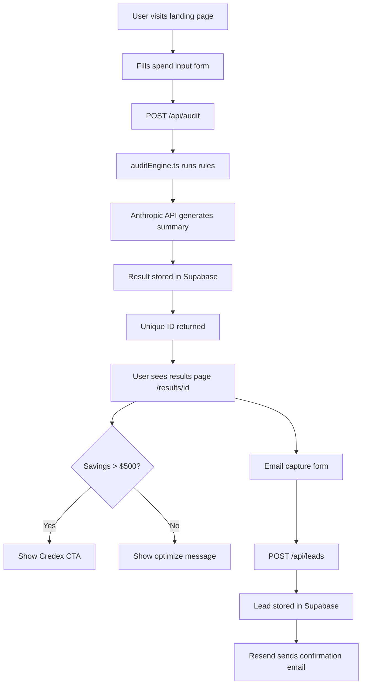

# Architecture

## System Diagram

## Data Flow

1. User fills form → localStorage persists state across reloads
2. On submit → POST /api/audit with AuditFormData
3. auditEngine.ts runs hardcoded rules → returns AuditResult
4. Anthropic API (claude-haiku) generates 80-100 word summary
5. Result stored in Supabase `audits` table with UUID
6. UUID returned → client redirects to /results/[id]
7. Results page fetches audit by ID → renders breakdown
8. User optionally submits email → stored in `leads` table
9. Resend sends confirmation email

## Why Next.js

- App Router gives API routes + SSR + client components in one framework
- No separate backend needed — reduces deployment complexity
- TypeScript support out of the box
- Vercel deployment is zero-config for Next.js

## Why Supabase

- Free tier is generous (500MB, 50k rows)
- Real-time capable for future features
- Built-in auth if needed later
- SQL-based — easy to query leads and audits

## Why hardcoded audit rules (not AI)

The assignment explicitly tests whether candidates know when NOT to use AI.
Audit math requires deterministic, defensible logic a finance person can verify.
AI would introduce hallucinations into financial calculations — unacceptable.

## What changes at 10k audits/day

- Move from Supabase free tier to Pro ($25/mo)
- Add Redis caching for repeated tool combinations
- Add a job queue (BullMQ) for async AI summary generation
- Add CDN caching for results pages (they're read-heavy)
- Consider edge runtime for API routes to reduce latency
