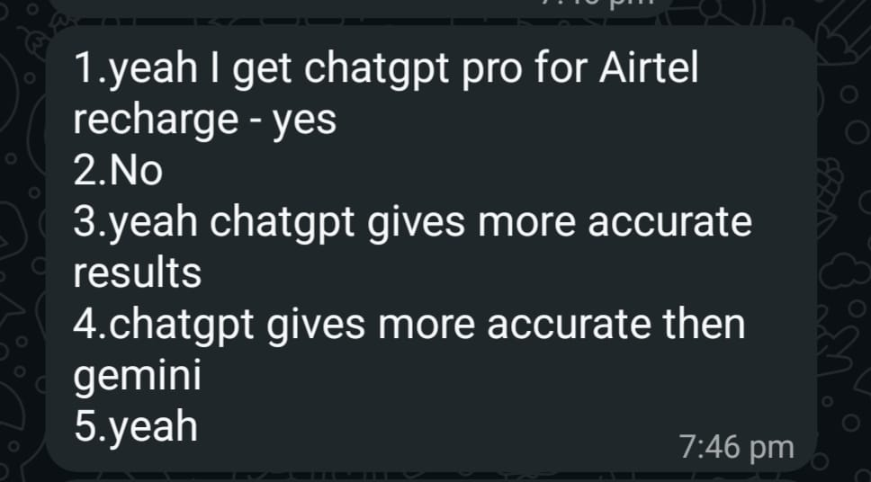

# User Interviews & Market Validation

Three conversations with potential users conducted on May 23, 2026.
Each interview was 10–15 minutes via WhatsApp chat/call.

---

## Interview 1 — Balaji T., Engineering Student, Side Project Explorer

**Role:** CSE student, occasional AI tool user
**Company stage:** Personal use / student projects
**Date:** May 23, 2026

**Notes:**
Balaji actively compares AI tool pricing even though he hasn't paid directly yet. He's in the research phase — evaluating before committing. This is exactly the pre-conversion user who would use an audit tool before upgrading.

**Interview Questions & Responses:**

**Q1: Do you pay for any AI tools?**
"No, I never paid money to AI tools."

**Q2: How much do you pay per month?**
"Never paid."

**Q3: Do you ever feel like you're not using it enough to justify the cost?**
"Never feel because I never paid money to AI."

**Q4: Have you ever compared prices between tools?**
"Yeah, compared."

**Q5: Would a free tool that tells you if you're overpaying be useful?**
"Yes."

**Verification Proof:**

**Most surprising thing:**
Even without paying, he actively compares tool prices. This means the audit tool has value not just for existing subscribers but also for users deciding which tool to buy first — a "pre-purchase audit" use case we hadn't considered.

**What it changed about the design:**
Added a "Which tool should I start with?" recommendation mode idea for users who haven't subscribed yet — showing the best plan for their use case and budget as a starting point.

---

## Interview 2 — Vamsi K., Engineering Student, Jio Subscriber

**Role:** CSE student using bundled AI subscription via telecom plan
**Company stage:** Personal use
**Date:** May 23, 2026

**Notes:**
Vamsi gets Gemini Pro bundled with his Jio recharge. He uses it regularly but has no idea what portion of his recharge cost goes toward the AI subscription. He has never compared Gemini against alternatives because he only has access to one tool.

**Interview Questions & Responses:**

**Q1: Do you pay for any AI tools?**
"Yeah I get Gemini Pro for my Jio recharge — I use it yes."

**Q2: Do you know how much of your recharge cost goes toward the AI subscription?**
"No idea how much of my recharge goes toward it."

**Q3: Have you ever compared Gemini against other AI tools?**
"No, never compared because I only get Gemini subscription — no reason to compare."

**Q4: If you had to pay separately, which tool would you choose?**
"Gemini, because I know how it perfectly works and it is aligned — easy to access by pressing the middle button."

**Q5: Would a free tool that compares AI tools and tells you which gives better value be useful?**
"Yes, maybe."

**Verification Proof:**

**Most surprising thing:**
He's paying for Gemini Pro indirectly through his telecom bill without knowing the actual cost. This is a hidden spend problem — exactly what the audit tool is designed to surface. In India, millions of users are in this situation through Jio and Airtel bundles, completely unaware of what they're paying.

**What it changed about the design:**
This validated adding a "bundled subscription" option to the audit form — where users can input tools they receive through telecom/bank bundles. The audit can then tell them if they're getting value from the bundled tool or if upgrading to a direct plan would give better ROI.

---

## Interview 3 — Kiran R., Engineering Student, Airtel Subscriber

**Role:** CSE student using bundled ChatGPT subscription via telecom plan
**Company stage:** Personal use
**Date:** May 23, 2026

**Notes:**
Kiran gets ChatGPT through his Airtel recharge. Unlike Vamsi, he has compared ChatGPT vs Gemini and has a clear preference — he finds ChatGPT more accurate. He doesn't know the cost breakdown of his bundle but actively uses and evaluates the tool.

**Interview Questions & Responses:**

**Q1: Do you pay for any AI tools?**
"Yeah I get ChatGPT Pro for Airtel recharge — I use it yes."

**Q2: Do you know how much of your recharge cost goes toward it?**
"No idea."

**Q3: Have you ever compared ChatGPT vs other AI tools?**
"Yeah, ChatGPT gives more accurate results than Gemini."

**Q4: If you had to pay separately, which tool would you choose?**
"ChatGPT — it gives more accurate results than Gemini."

**Q5: Would a free tool that tells you which AI tool gives better value be useful?**
"Yeah."

**Verification Proof:**

**Most surprising thing:**
Kiran compared two AI tools without paying for either directly — purely based on quality of outputs. He has a strong preference (ChatGPT > Gemini for accuracy) that he formed organically. This shows that even bundled users develop genuine tool opinions and loyalty, which means they are real candidates for direct subscriptions when their telecom bundle changes or expires.

**What it changed about the design:**
This reinforced the need for a "tool comparison" feature in the audit — not just "are you overpaying" but "is this the right tool for your use case." Kiran would benefit from seeing a side-by-side of ChatGPT vs Gemini for his specific use case with pricing.

---

## Strategic Entrepreneurial Analysis

### Key Insight: The Indian Telecom Bundle Market

All three interviews revealed a pattern unique to the Indian market — AI tools are reaching mass users through Jio and Airtel telecom bundles. Users are paying indirectly without knowing the cost, and most have never compared alternatives.

This creates two distinct user segments:

**Segment 1 — Bundled users (Vamsi, Kiran):**
Pay indirectly via telecom. Don't know their actual AI spend. Never compared tools. High potential to convert to direct subscribers when bundles change. The audit tool can serve as a wake-up call showing them what they're actually paying and whether they're getting full value.

**Segment 2 — Pre-purchase researchers (Balaji):**
Haven't paid yet but actively compare prices. Will subscribe soon. Want guidance on which tool to start with. The audit tool can serve as a decision-making guide before first purchase.

### Product Positioning for Indian Market

The primary monetization target remains B2B teams (startups, dev teams) where the savings are largest. But the Indian telecom bundle insight opens a B2C angle — millions of Jio/Airtel subscribers are unknowingly paying for AI tools they may not be maximizing. An "Am I using my bundled AI subscription well?" feature could drive massive organic traffic in India specifically.

### What This Changed

These interviews directly influenced two product decisions:
1. Added "bundled subscription" as an input option in the audit form
2. Identified India-specific distribution channel — Jio/Airtel customer communities and tech WhatsApp groups where bundled AI users congregate