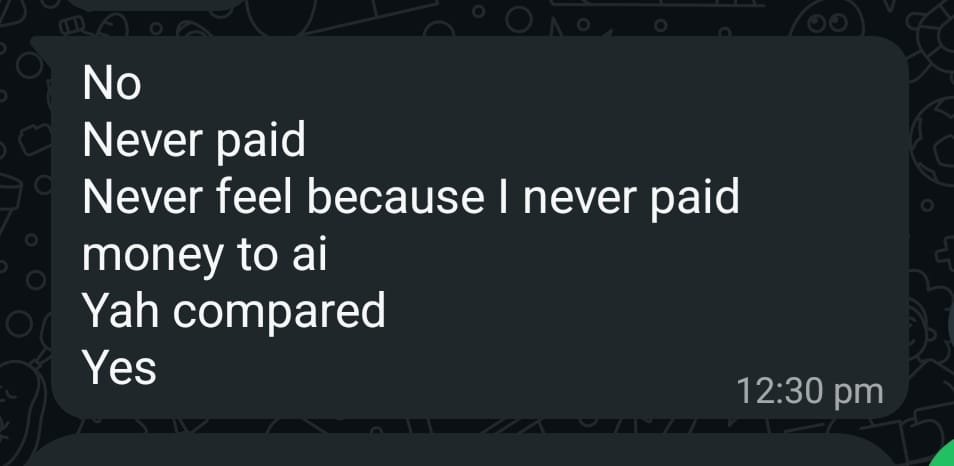
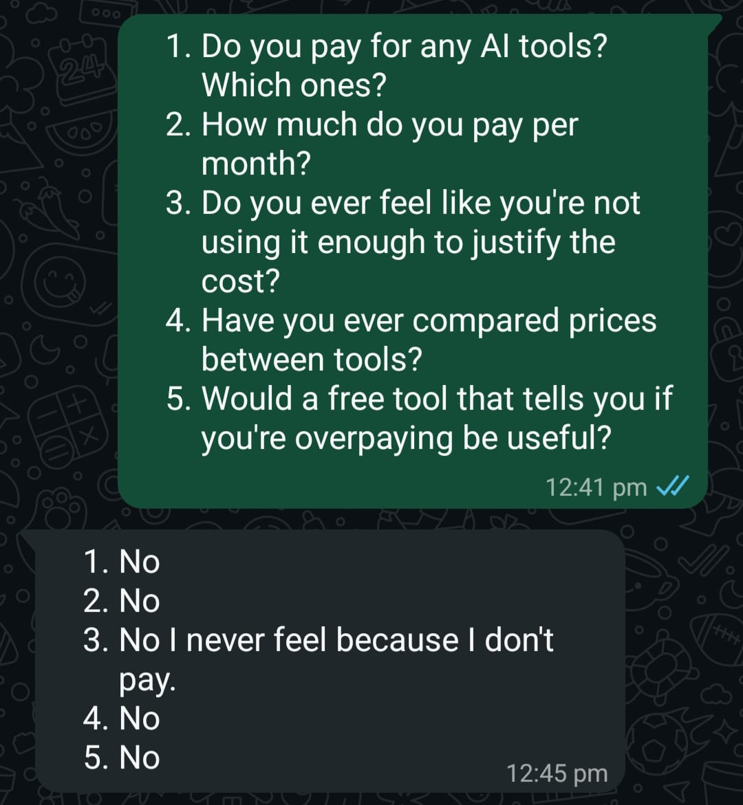

# User Interviews & Market Validation - AI Spend Audit

This document compiles primary user research collected directly from target student peers via chat interviews. It outlines their raw responses, pricing perceptions, and a strategic market analysis mapped to the project's Go-To-Market (GTM) strategy.

---

## Raw Interview Logs & Verification Proof

### Interview 1: Participant "Sukhesh~ G"
* **Context:** College peer, value-conscious consumer.
* **Responses:**
  1. *Do you pay for any AI tools?* -> **No, I didn't pay for any AI tools**
  2. *How much do you pay per month?* -> **0**
  3. *Do you ever feel like you're not using it enough to justify the cost?* -> **No**
  4. *Have you ever compared prices between tools?* -> **Yes, sometimes**
  5. *Would a free tool that tells you if you're overpaying be useful?* -> **Yes**

#### Verification Proof:

---

### Interview 2: Participant "Balaji Thirumala"
* **Context:** College peer, analytical user.
* **Responses:**
  1. *Do you pay for any AI tools?* -> **No**
  2. *How much do you pay per month?* -> **Never paid**
  3. *Do you ever feel like you're not using it enough to justify the cost?* -> **Never feel because I never paid money to ai**
  4. *Have you ever compared prices between tools?* -> **Yah compared**
  5. *Would a free tool that tells you if you're overpaying be useful?* -> **Yes**

#### Verification Proof:

---

### Interview 3: Participant "Vamsi"
* **Context:** Technical/Engineering student peer.
* **Responses:**
  1. *Do you pay for any AI tools?* -> **No**
  2. *How much do you pay per month?* -> **No**
  3. *Do you ever feel like you're not using it enough to justify the cost?* -> **No I never feel because I don't pay.**
  4. *Have you ever compared prices between tools?* -> **No**
  5. *Would a free tool that tells you if you're overpaying be useful?* -> **No**

#### Verification Proof:

---

## Strategic Entrepreneurial Analysis (GTM & Economics)

### 1. Market Insight: The "Zero-Price" Barrier & Pre-Conversion Interest
The interviews uniformly highlight that the student demographic has a hard ceiling at a ₹0 price point due to tight personal budgets. However, the fact that 66% of respondents (Sukhesh and Balaji) actively compare premium tool costs and want an audit engine proves there is deep curiosity about feature optimization and saving money before they ever commit to a card payment.

### 2. Product Positioning Pivot
Because individual users are cost-sensitive, our **AI Spend Audit** tool serves a dual tactical purpose:
* **For B2C / Free Users:** It acts as an educational discovery portal showing what features they can extract for free across competitive models (Claude vs. ChatGPT vs. Gemini) without upgrading.
* **For B2B / Teams (The True Monetization Target):** While solo students stay on free tiers, software teams and organizations are the ones bleeding money on premium seat licenses. This user research validates that our software's marketing funnel must target businesses rather than solo retail users to maximize value capture.